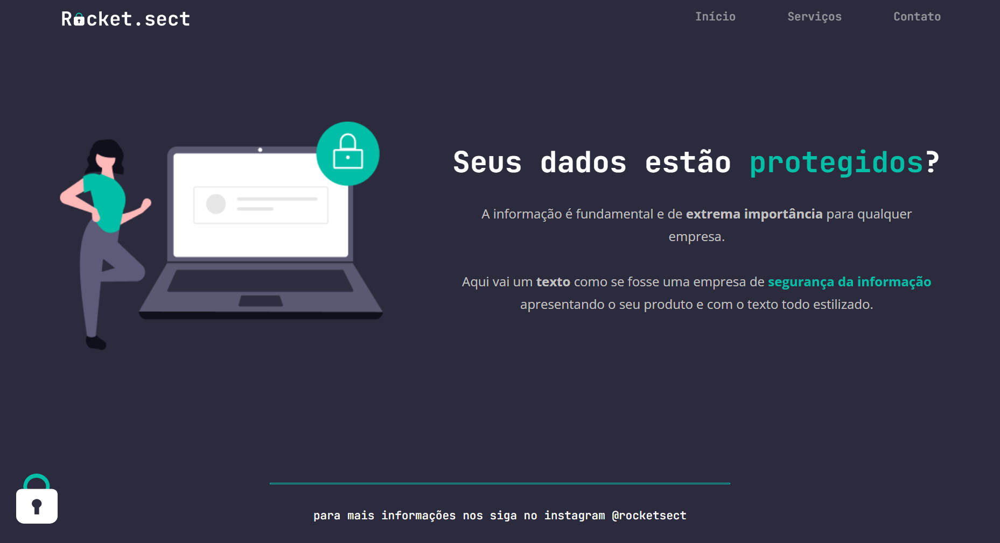

# Rocketseat Explorer - Stage 02 Projeto Solo

Projeto de uma página fictícia de segurança digital.

Primeiro projeto desenvolvido no modo solo dento do curso Explorer da Rocketseat c:

Este projeto foi desenvolvido em 00h 59min 14.

[Clique aqui para acessar](https://buucocs.github.io/expl-stg2-mdl2-projeto_solo/)

## Tecnologias

- HTML
- CSS
- Git e Github

## Contato

- contato@leonardohgomes.com.br
- @leonardohgomes_
- https://github.com/Buucocs